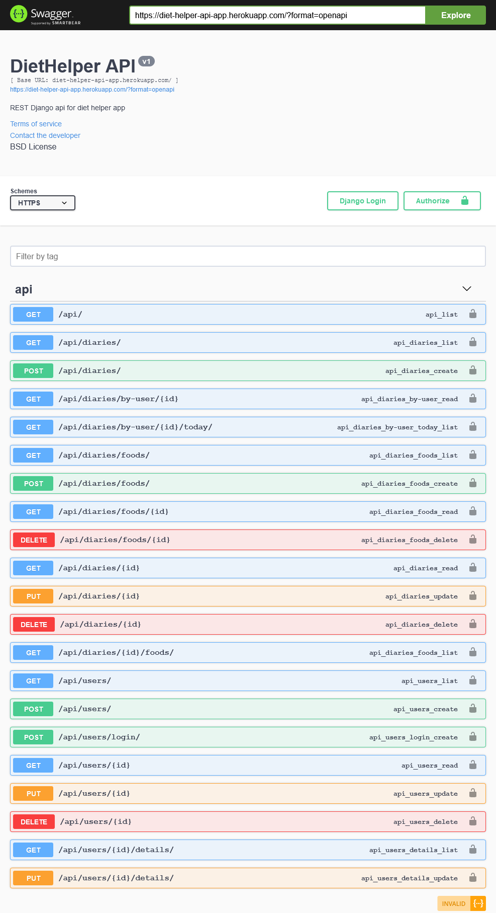
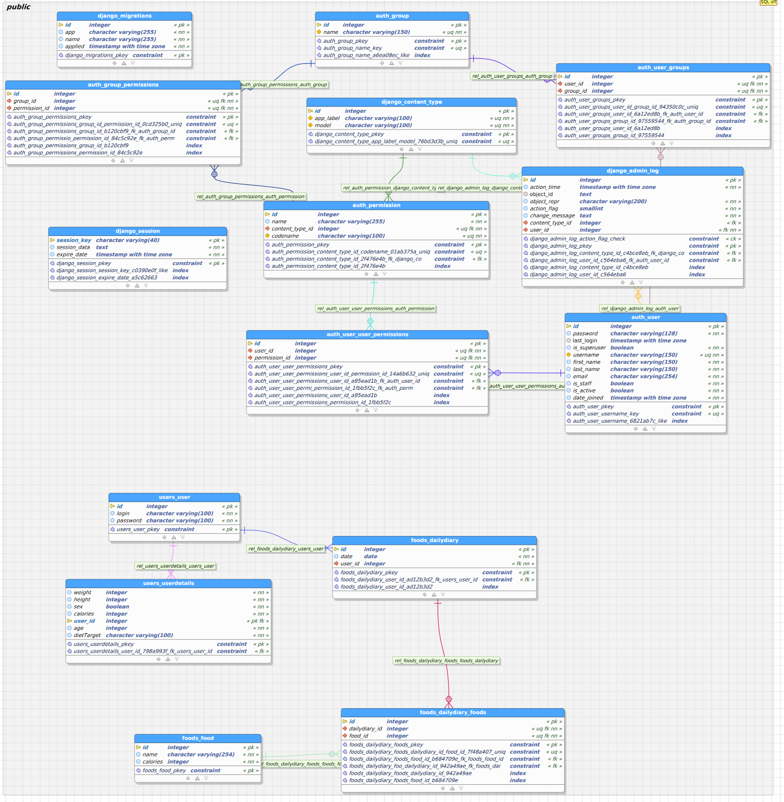

  
# Diet Helper API in Python (Django) 💻   
API dla aplikacji webowej do prowadzenia diety i obliczania zapotrzebowania kalorycznego/BMI. Stworzona w języku python z użyciem Django Rest Framework.    

Licencja:

## Technologie 🎆

 
Stworzony projekt wykorzystuje **Django**. Django Rest zapewnia wydajną serializację modeli, wyświetlanie danych przy użyciu standardowych widoków opartych na funkcjach lub uzyskanie szczegółowego widoku z potężnymi widokami opartymi na klasach w celu uzyskania bardziej złożonych funkcji. Wszystko w opakowaniu zgodnym z REST. 

Do opisu i stworzenia spójnej dokumentacji dla zbudowanego API wykorzystano narzędzie **Swagger**. Interfejs Swagger UI pozwala każdemu – zespołowi programistycznego lub użytkownikom aplikacji na wizualizację zasobów API i korzystanie z nich bez konieczności posiadania zewnętrznych aplikacji. Kluczową przewagą wykorzystania tego narzędzia jest uzyskanie samoaktualizującej się dokumentacji. Wyniki tej dokumentacji zostaną zaprezentowane niżej w prezentacji spisu wszystkich endpointów, które są wystawione przez aplikację.

W projekecie wykorzystano bazę danych **PostgreSQL**, który jest jest jednym z najbardziej popularnych systemów zarządania obiektowo-relacyjną bazą danych i jednym z niewielu systemów zarządania bazą danych oferujących obiektowo-relacyjne podejście do baz danych.   
    
## Dokumentacja wszystkich endpointów dostarczanych przez  API 📋    
 I use swagger-ui in the project, so you get the current Mentoring API documentation every time.  You can read it yourself,  just run the application and go to: *server-ip:port/swagger-ui.html* 😉    
     
    
    
## Uruchomienie 🚀    
Do uruchomienia aplikacji potrzebować będziesz:
- Python 3 (w wersji przynajmniej 3.8)
- PostgreSQL

| Lista zależności                                                                                                                                                                                                                                                                                                                                                                                                                                                                                                                                                                                                                                                    |
|---------------------------------------------------------------------------------------------------------------------------------------------------------------------------------------------------------------------------------------------------------------------------------------------------------------------------------------------------------------------------------------------------------------------------------------------------------------------------------------------------------------------------------------------------------------------------------------------------------------------------------------------------------------------|
| asgiref==3.3.1, astroid==2.4.2, certifi==2020.12.5, chardet==4.0.0, coreapi==2.3.3, coreschema==0.0.4, dj-database-url==0.5.0, Django==3.1.4, django-cors-headers==3.6.0, djangorestframework==3.12.2, drf-yasg==1.20.0, gunicorn==20.0.4, idna==2.10, inflection==0.5.1, isort==5.7.0, itypes==1.2.0, Jinja2==2.11.2, lazy-object-proxy==1.4.3, MarkupSafe==1.1.1, mccabe==0.6.1, openapi-codec==1.3.2, packaging==20.8, psycopg2-binary==2.8.6, pylint==2.6.0, pyparsing==2.4.7, pytz==2020.5, requests==2.25.1, ruamel.yaml==0.16.12, ruamel.yaml.clib==0.2.2, simplejson==3.17.2, six==1.15.0, sqlparse==0.4.1, toml==0.10.2, uritemplate==3.0.1, urllib3==1.26.2, whitenoise==5.2.0, wrapt==1.12.1 |

Twoje środowisko musi je posiadać do poprawnego uruchomienia aplikacji. W przypadku braku, któregoś z nich wystarczy wykonać polecenie `pip install <name>`

### Uruchomienie aplikacji lokalnie 🏠
Aby uruchomić aplikację lokalnie wystarczy, że zmienisz ustawienia w `settings.py` podając adres dla bazy danych PostgreSQL, możesz też odkomentować linie 90-98, aby wykorzystać lokalną bazę SQLite.

Metoda 1 (podanie swojej bazy danych):
`DATABASES = {  
    'default': {  
        'ENGINE': 'django.db.backends.postgresql_psycopg2',  
  'NAME': 'diet_helper_db',  
  'USER': 'postgres',  
  'PASSWORD': 'postgres',  
  'HOST': '127.0.0.1',  
  'PORT': '5432',  
  }  
}`

Metoda 2 (wykorzystanie bazy lokalniej):
`DATABASES = {  
    'default': {  
        'ENGINE': 'django.db.backends.sqlite3',  
  'NAME': BASE_DIR / 'db.sqlite3',  
  }  
}`

Następnie należy dokonać migracji bazy w celu utworzenia jej schematu i tabel:
`python manage.py makemigrations`
oraz
`python manage.py migrate`

Uruchomienie aplikacji:
`python manage.py runserver`

Gotowe!

### Uruchomienie aplikacji na środowisku produkcyjnym 🏭
W tym celu podobnie jak wcześniej należy podać adres bazy danych PostgreSQL. Następnie utworzyć środowisko `env` i aktywować je:
`python3 -m venv env`
`source env/bin/activate`

Teraz trzeba wygenerować pliki statyczne dla aplikacji:
`python3 manage.py collectstatic --noinput`

Następnie utworzyć plik `procfile` w katalogu głównym projektu i wkleić do niego:
`web: gunicorn diet_helper_api.wsgi`

Wygenerwoać zależności do pliku `requirements.txt`
`pip freeze > requirements.txt`

Utworzyć plik `rutime.txt` zawierający informację o wersji pythona:
`python-3.8.5`

Od teraz aplikacja jest gotowa do wystawienia na serwer produkcyjny. Po jej zbudowaniu należy wykonać po stronie serwera operację na bazie danych aby dokonać migracji.
`python manage.py makemigrations`
oraz
`python manage.py migrate`

Gotowe!

### Schemat bazy danych PostgreSQL 🔄
   

    
## Informacje końcowe 🏁
 Projekt został stworzony w ramach przedmiotu Praktyka Programowania Python.

Autorzy:
- Legutko Jakub
- Niemczyk Piotr
- Szymański Marek

Kod aplikacji jest otwarty i dostępny dla każdego.
